# Fix Mobile App Bet Type Mappings for On-Chain Parity

**Type**: fix: Bug Fix / Feature Parity
**Priority**: Critical (financial impact - wrong bets may be recorded)
**Created**: 2025-12-27

---

## Overview

The mobile app bet type definitions do not match the audited web app or on-chain Rust program, causing:
1. **Transaction failures** - Non-existent bet types (e.g., `PLACE_6`, `ANY_7`) fail on-chain
2. **Wrong bets recorded** - Incorrect numeric mappings (Sic Bo) cause users to bet on unintended types
3. **Missing functionality** - Valid bet types from web app not available in mobile

This plan ensures 100% bet type parity between mobile, web, and on-chain, with full test coverage on local validator.

---

## Problem Statement

### Complete Audit Results (All 10 Games)

---

#### 1. Craps - Invalid/Missing Bet Types ⚠️ CRITICAL

| Mobile App Type | On-Chain Rust | Issue | Fix |
|-----------------|---------------|-------|-----|
| `PLACE_4` - `PLACE_10` | N/A | **Does not exist** | Use `YES` (value=5) + target |
| `HARD_4/6/8/10` | Hardway4-10 (8-11) | String, not numeric | Map to 8, 9, 10, 11 |
| `ANY_7` | N/A | **Does not exist** | Remove from UI |
| `ANY_CRAPS` | N/A | **Does not exist** | Remove from UI |
| `YO_11` | N/A | **Does not exist** | Use `NEXT` (7) + target=11 |
| `SNAKE_EYES` | N/A | **Does not exist** | Use `NEXT` (7) + target=2 |
| `BOXCARS` | N/A | **Does not exist** | Use `NEXT` (7) + target=12 |
| *Missing* | `YES=5` | Not in mobile | Add Place bet |
| *Missing* | `NO=6` | Not in mobile | Add Lay bet |
| *Missing* | `NEXT=7` | Not in mobile | Add Hop bet |
| *Missing* | `FIRE=12` | Not in mobile | Add Fire bet |
| *Missing* | `ATS 15-17` | Not in mobile | Add ATS bets |
| *Missing* | Side bets 18-22 | Not in mobile | Add side bets |

---

#### 2. Sic Bo - Wrong Numeric Mappings ⚠️ CRITICAL

| Web App Type | Current Mapping | Correct On-Chain | Status |
|--------------|-----------------|------------------|--------|
| `SUM` | 4 | `Total = 7` | **WRONG** |
| `SINGLE_DIE` | 5 | `Single = 8` | **WRONG** |
| `TRIPLE_SPECIFIC` | 7 | `SpecificTriple = 4` | **WRONG** |
| `TRIPLE_ANY` | 8 | `AnyTriple = 5` | **WRONG** |

---

#### 3. Baccarat - Missing Side Bets ⚠️ HIGH

**On-Chain Rust** (`baccarat.rs:159-171`):
```rust
pub enum BetType {
    Player = 0,
    Banker = 1,
    Tie = 2,
    PlayerPair = 3,
    BankerPair = 4,
    EitherPair = 5,
    PerfectPair = 6,
    Super6 = 7,
    Natural = 8,
    PlayerPerfectPair = 9,
    BankerPerfectPair = 10,
}
```

**Gateway** (`baccarat.ts`): Only supports `Player(0)`, `Banker(1)`, `Tie(2)` - **missing 8 side bets**

**Web App** (`useBaccarat.ts`): Defines BaccaratBetType but excludes PLAYER/BANKER main bets

| Status | Bet Types |
|--------|-----------|
| ✓ Supported | Player (0), Banker (1), Tie (2) |
| ✗ Missing | PlayerPair (3), BankerPair (4), EitherPair (5), PerfectPair (6), Super6 (7), Natural (8), PlayerPerfectPair (9), BankerPerfectPair (10) |

---

#### 4. Casino War - Critical Surrender Bug 🔴 CRITICAL BUG

**On-Chain Rust** (`casino_war.rs:109-115`):
```rust
pub enum Move {
    Play = 0,
    War = 1,
    Surrender = 2,
}
```

**Gateway Bug** (`casinowar.ts:64-66`):
```typescript
// handleSurrender sends WRONG value:
const payload = new Uint8Array([0]);  // WRONG - sends Play instead of Surrender!
// Should be:
const payload = new Uint8Array([2]);  // Surrender = 2
```

**Impact**: All surrender actions silently treated as "Play" on-chain!

---

#### 5. Roulette - Naming Mismatches & Missing Bets

**On-Chain Rust** (`roulette.rs:130-145`):
```rust
pub enum BetType {
    Straight = 0,    // Web: STRAIGHT
    Split = 1,       // Web: SPLIT (missing in mobile)
    Street = 2,      // Web: STREET (missing in mobile)
    Corner = 3,      // Web: CORNER (missing in mobile)
    Basket = 4,      // Web: BASKET
    SixLine = 5,     // Web: SIX_LINE (missing in mobile)
    Column = 6,      // Web: COLUMN
    Dozen = 7,       // Web: DOZEN
    Red = 8,         // Web: RED
    Black = 9,       // Web: BLACK
    Odd = 10,        // Web: ODD
    Even = 11,       // Web: EVEN
    Low = 12,        // Mobile uses "1-18" - naming difference
    High = 13,       // Mobile uses "19-36" - naming difference
}
```

| Issue | Mobile | On-Chain | Fix |
|-------|--------|----------|-----|
| Naming | `1-18` | `Low (12)` | Use LOW/HIGH naming |
| Naming | `19-36` | `High (13)` | Use LOW/HIGH naming |
| Missing | N/A | Split (1) | Add inside bet |
| Missing | N/A | Street (2) | Add inside bet |
| Missing | N/A | Corner (3) | Add inside bet |
| Missing | N/A | SixLine (5) | Add inside bet |

---

#### 6. HiLo - Constants File Bug

**On-Chain Rust**: `Higher=1, Lower=2, Same=3`

**Gateway constants.ts** (`codec/constants.ts:68-72`):
```typescript
export const HiLoGuess = {
  Higher: 1,
  Lower: 2,
  Same: 2,  // BUG! Should be 3
} as const;
```

**Note**: Actual gateway handler code correctly uses `[3]` for Same, but constants.ts is wrong.

---

#### 7. Ultimate Texas Hold'em - Message Format Mismatch

**Mobile** sends bet messages with `amount` field:
```typescript
{ type: 'ultimate_tx_bet', amount: 1000 }
```

**Gateway** (`ultimateholdem.ts:124-128`) expects `multiplier` field:
```typescript
const multiplier = msg.multiplier as number | undefined;
```

**Impact**: Mobile bet amounts ignored - gateway gets undefined multiplier.

---

#### 8. Three Card Poker - Missing AtomicDeal Action

**On-Chain Rust** (`three_card.rs`) has `AtomicDeal = 7`

**Gateway** (`threecardpoker.ts:16-25`): Missing AtomicDeal action code:
```typescript
const ThreeCardMove = {
  Play: 0,
  Fold: 1,
  Deal: 2,
  SetPairPlus: 3,
  Reveal: 4,
  SetSixCardBonus: 5,
  SetProgressive: 6,
  SetRules: 8,  // Note: Skips 7 (AtomicDeal)
} as const;
```

Also incomplete side bet (PairPlus, SixCardBonus) handling.

---

#### 9. Blackjack ✓ CORRECT

All bet type mappings verified correct:
- Main bets: Bet, Insurance, Split, Double, Stand, Hit, Surrender
- 21+3 side bet implemented and working
- No discrepancies found

---

#### 10. Video Poker ✓ CORRECT

All action mappings verified correct:
- Deal, Hold, Draw actions properly encoded
- No discrepancies found
- Note: Web app lacks functional hook (useVideoPoker not fully implemented)

---

## Proposed Solution

### Architecture: Shared Constants with Single Source of Truth

Create a shared bet type constants module imported by both gateway and mobile, derived from Rust on-chain enums.

```
shared/constants/
├── bet-types.ts          # All bet type enums (from Rust)
├── game-types.ts         # GameType enum
└── validation.ts         # Bet validation helpers
```

### Implementation Approach

1. **Audit** all 10 games for mapping discrepancies
2. **Create** authoritative bet type mappings from Rust enums
3. **Update** mobile app to use correct mappings
4. **Fix** web app Sic Bo mappings
5. **Test** 100% bet coverage on local validator

---

## Technical Approach

### Phase 1: Audit & Documentation

**Goal**: Complete inventory of all bet types across all layers

#### Tasks

- [ ] **1.1** Extract complete bet type enums from Rust on-chain code
  - File: `/execution/src/casino/*.rs`
  - Output: JSON/TypeScript mapping for each game

- [ ] **1.2** Audit all 10 games for discrepancies
  - Games: Baccarat, Blackjack, CasinoWar, Craps, HiLo, Roulette, SicBo, ThreeCardPoker, UltimateHoldem, VideoPoker
  - Compare: mobile types vs web types vs Rust enums

- [ ] **1.3** Document target value encoding scheme
  - How does `YES` + target work in transaction payload?
  - Is target a separate field or packed into bet type?

- [ ] **1.4** Create authoritative mapping document
  - File: `/docs/bet-type-mappings.md`

#### Relevant Files

```
/execution/src/casino/craps.rs:168-191       # Craps BetType enum
/execution/src/casino/roulette.rs:130-145    # Roulette BetType enum
/execution/src/casino/sic_bo.rs:127-141      # SicBo BetType enum
/website/src/hooks/games/useCraps.ts:34-55   # Web Craps mapping
/website/src/hooks/games/useSicBo.ts:10-17   # Web SicBo mapping (WRONG)
/mobile/src/types/index.ts:83-103            # Mobile Craps types
```

### Phase 2: Create Shared Constants

**Goal**: Single source of truth for bet types

#### Tasks

- [ ] **2.1** Create shared bet type constants file
  - Location: `/gateway/src/codec/bet-types.ts` (imported by mobile)

```typescript
// bet-types.ts
export const CrapsBetType = {
  Pass: 0,
  DontPass: 1,
  Come: 2,
  DontCome: 3,
  Field: 4,
  Yes: 5,           // Place bet - uses target (4, 5, 6, 8, 9, 10)
  No: 6,            // Lay bet - uses target
  Next: 7,          // Hop bet - uses target
  Hardway4: 8,
  Hardway6: 9,
  Hardway8: 10,
  Hardway10: 11,
  Fire: 12,
  AtsSmall: 15,
  AtsTall: 16,
  AtsAll: 17,
  Muggsy: 18,
  DiffDoubles: 19,
  RideLine: 20,
  Replay: 21,
  HotRoller: 22,
} as const;

export type CrapsBetType = typeof CrapsBetType[keyof typeof CrapsBetType];
```

- [ ] **2.2** Create SicBo bet type constants with CORRECT mappings

```typescript
export const SicBoBetType = {
  Small: 0,
  Big: 1,
  Odd: 2,
  Even: 3,
  SpecificTriple: 4,  // Was 7 in web - FIXED
  AnyTriple: 5,       // Was 8 in web - FIXED
  SpecificDouble: 6,
  Total: 7,           // Was 4 in web - FIXED
  Single: 8,          // Was 5 in web - FIXED
  Domino: 9,
  ThreeNumberEasyHop: 10,
  ThreeNumberHardHop: 11,
  FourNumberEasyHop: 12,
} as const;
```

- [ ] **2.3** Add bet validation helpers

```typescript
export function isValidCrapsBetType(value: number): value is CrapsBetType {
  return Object.values(CrapsBetType).includes(value as CrapsBetType);
}

export function requiresTarget(betType: CrapsBetType): boolean {
  return [CrapsBetType.Yes, CrapsBetType.No, CrapsBetType.Next].includes(betType);
}
```

- [ ] **2.4** Create reverse mapping for decoding

```typescript
export const CrapsBetTypeName = Object.fromEntries(
  Object.entries(CrapsBetType).map(([k, v]) => [v, k])
) as Record<CrapsBetType, string>;
```

#### Relevant Files

```
/gateway/src/codec/constants.ts:1-50         # Current constants (extend)
/gateway/src/codec/bet-types.ts              # NEW - shared bet types
```

### Phase 3: Fix Mobile App

**Goal**: Update mobile to use correct bet type mappings

#### Tasks

- [ ] **3.1** Update mobile Craps types
  - Remove: `PLACE_X`, `ANY_7`, `ANY_CRAPS`, `YO_11`, `SNAKE_EYES`, `BOXCARS`
  - Add: `YES`, `NO`, `NEXT`, `FIRE`, `ATS_*`, side bets
  - File: `/mobile/src/types/index.ts`

- [ ] **3.2** Update mobile Craps screen bet placement
  - Map `HARD_X` to numeric values (8-11)
  - Use `YES` with target for Place bets
  - Use `NEXT` with target for Hop bets
  - File: `/mobile/src/screens/games/CrapsScreen.tsx`

- [ ] **3.3** Update mobile bet encoding to match web
  - Ensure binary payload format matches web app
  - File: `/mobile/src/services/` (bet encoding)

- [ ] **3.4** Add UI for missing bet types (if in scope)
  - Place bets (YES)
  - Lay bets (NO)
  - Hop bets (NEXT)
  - Fire bet
  - ATS bets

```typescript
// Before (WRONG)
export type CrapsBetType =
  | 'PASS' | 'DONT_PASS' | 'COME' | 'DONT_COME' | 'FIELD'
  | 'PLACE_4' | 'PLACE_5' | 'PLACE_6' | 'PLACE_8' | 'PLACE_9' | 'PLACE_10'
  | 'HARD_4' | 'HARD_6' | 'HARD_8' | 'HARD_10'
  | 'ANY_7' | 'ANY_CRAPS' | 'YO_11' | 'SNAKE_EYES' | 'BOXCARS';

// After (CORRECT)
export type CrapsBetType =
  | 'PASS' | 'DONT_PASS' | 'COME' | 'DONT_COME' | 'FIELD'
  | 'YES' | 'NO' | 'NEXT'
  | 'HARDWAY_4' | 'HARDWAY_6' | 'HARDWAY_8' | 'HARDWAY_10'
  | 'FIRE'
  | 'ATS_SMALL' | 'ATS_TALL' | 'ATS_ALL'
  | 'MUGGSY' | 'DIFF_DOUBLES' | 'RIDE_LINE' | 'REPLAY' | 'HOT_ROLLER';
```

#### Relevant Files

```
/mobile/src/types/index.ts:83-103            # Craps bet types
/mobile/src/screens/games/CrapsScreen.tsx    # Craps UI
/mobile/src/services/crypto.ts               # Transaction signing
```

### Phase 4: Fix Web App Sic Bo

**Goal**: Correct the wrong Sic Bo mappings in web app

#### Tasks

- [ ] **4.1** Update `useSicBo.ts` bet type mapping

```typescript
// Before (WRONG)
const sicBoBetToNumeric = (bet: SicBoBet) => {
  const betTypeMap: Record<SicBoBet['type'], number> = {
    'SMALL': 0, 'BIG': 1, 'ODD': 2, 'EVEN': 3,
    'SUM': 4,             // WRONG - should be 7
    'SINGLE_DIE': 5,      // WRONG - should be 8
    'DOUBLE_SPECIFIC': 6,
    'TRIPLE_SPECIFIC': 7, // WRONG - should be 4
    'TRIPLE_ANY': 8,      // WRONG - should be 5
    'DOMINO': 9, 'HOP3_EASY': 10, 'HOP3_HARD': 11, 'HOP4_EASY': 12
  };
};

// After (CORRECT)
const sicBoBetToNumeric = (bet: SicBoBet) => {
  const betTypeMap: Record<SicBoBet['type'], number> = {
    'SMALL': 0, 'BIG': 1, 'ODD': 2, 'EVEN': 3,
    'TRIPLE_SPECIFIC': 4, // FIXED
    'TRIPLE_ANY': 5,      // FIXED
    'DOUBLE_SPECIFIC': 6,
    'SUM': 7,             // FIXED
    'SINGLE_DIE': 8,      // FIXED
    'DOMINO': 9, 'HOP3_EASY': 10, 'HOP3_HARD': 11, 'HOP4_EASY': 12
  };
};
```

- [ ] **4.2** Verify web app builds after fix
- [ ] **4.3** Test Sic Bo bet placement on local validator

#### Relevant Files

```
/website/src/hooks/games/useSicBo.ts:10-17   # WRONG mappings to fix
```

### Phase 5: Testing & Validation

**Goal**: 100% bet coverage verified on local validator

#### Tasks

- [ ] **5.1** Create comprehensive bet type test suite
  - Location: `/gateway/tests/integration/bet-parity.test.ts`

```typescript
// bet-parity.test.ts
describe('Bet Type Parity Tests', () => {
  describe('Craps', () => {
    it.each([
      ['PASS', 0],
      ['DONT_PASS', 1],
      ['COME', 2],
      ['DONT_COME', 3],
      ['FIELD', 4],
      ['YES', 5],
      ['NO', 6],
      ['NEXT', 7],
      ['HARDWAY_4', 8],
      ['HARDWAY_6', 9],
      ['HARDWAY_8', 10],
      ['HARDWAY_10', 11],
      ['FIRE', 12],
      ['ATS_SMALL', 15],
      ['ATS_TALL', 16],
      ['ATS_ALL', 17],
    ])('should map %s to %d', async (betName, expected) => {
      const encoded = encodeCrapsBet({ type: betName, amount: 100 });
      const decoded = decodeBetType(encoded);
      expect(decoded).toBe(expected);
    });
  });

  describe('Sic Bo', () => {
    it.each([
      ['SMALL', 0],
      ['BIG', 1],
      ['ODD', 2],
      ['EVEN', 3],
      ['TRIPLE_SPECIFIC', 4],
      ['TRIPLE_ANY', 5],
      ['DOUBLE_SPECIFIC', 6],
      ['SUM', 7],
      ['SINGLE_DIE', 8],
      ['DOMINO', 9],
    ])('should map %s to %d', async (betName, expected) => {
      const encoded = encodeSicBoBet({ type: betName, amount: 100 });
      const decoded = decodeBetType(encoded);
      expect(decoded).toBe(expected);
    });
  });
});
```

- [ ] **5.2** Create local validator integration tests
  - Test each bet type succeeds on-chain
  - Verify correct bet type recorded in state
  - File: `/gateway/tests/integration/integration.test.ts`

- [ ] **5.3** Test Craps target value bets
  - YES with targets: 4, 5, 6, 8, 9, 10
  - NO with targets: 4, 5, 6, 8, 9, 10
  - NEXT with targets: 2-12

- [ ] **5.4** Run full test suite

```bash
# Start local validator
./start-local-network.sh

# Run parity tests
npm test -- tests/bet-parity.test.ts

# Run integration tests
RUN_INTEGRATION=true npm test -- tests/integration.test.ts
```

- [ ] **5.5** Manual testing on mobile app
  - Place each bet type
  - Verify transaction succeeds
  - Verify bet appears correctly in game state

#### Relevant Files

```
/gateway/tests/integration/bet-parity.test.ts            # NEW - bet parity tests
/gateway/tests/integration/integration.test.ts:1-100     # Existing integration tests
./start-local-network.sh                     # Validator startup script
```

### Phase 6: Documentation

**Goal**: Document changes and update procedures

#### Tasks

- [ ] **6.1** Update `/docs/updates.md` with:
  - Summary of changes
  - Migration notes
  - Testing procedures

- [ ] **6.2** Add inline code comments explaining bet type mappings

- [ ] **6.3** Document local validator testing procedure

---

## Acceptance Criteria

### Functional Requirements

- [ ] All 10 games have correct bet type mappings matching on-chain Rust enums
- [ ] Mobile app can successfully place every bet type available in web app
- [ ] No non-existent bet types in mobile app (PLACE_X, ANY_7, etc. removed)
- [ ] Sic Bo bet types correctly mapped (SUM=7, SINGLE_DIE=8, etc.)
- [ ] Target value bets (YES/NO/NEXT) work with all valid targets

### Non-Functional Requirements

- [ ] All bet placements complete within 5 seconds on local validator
- [ ] Error messages are clear when bet fails
- [ ] No breaking changes to existing working bets

### Quality Gates

- [ ] 100% of bet types pass parity tests
- [ ] 100% of bet types succeed on local validator
- [ ] Code review approved
- [ ] No regressions in existing tests

---

## Success Metrics

| Metric | Target | Measurement |
|--------|--------|-------------|
| Bet type parity | 100% | All mobile bet types match web/on-chain |
| Validator success rate | 100% | All bet types succeed on local validator |
| Test coverage | 100% | Every bet type has unit test |
| Integration test pass | 100% | All integration tests pass |

---

## Dependencies & Prerequisites

### Required

- [ ] Local validator accessible and running
- [ ] Access to Rust on-chain source code (`/execution/src/casino/`)
- [ ] Mobile development environment set up

### May Block

- If Rust enum definitions change, TypeScript constants must be regenerated
- If transaction payload format differs from expected, encoding logic needs update

---

## Risk Analysis & Mitigation

| Risk | Likelihood | Impact | Mitigation |
|------|------------|--------|------------|
| Wrong Sic Bo bets already recorded | High | High | Cannot retroactively fix; document for users |
| Breaking existing working bets | Medium | High | Comprehensive test coverage |
| Missing bet types we don't know about | Medium | Medium | Audit all 10 games thoroughly |
| Target value encoding mismatch | Medium | High | Verify against web app encoding |

---

## Open Questions

1. **Craps target encoding**: Is target a separate field in transaction payload, or part of bet type enum?
2. **UI scope**: Should we add UI for all missing bet types (YES/NO/NEXT/FIRE/ATS), or just fix mappings?
3. **Other games**: Are there mapping issues in games beyond Craps and Sic Bo?
4. **Backwards compatibility**: How to handle old app versions after fix?

---

## References

### Internal Files

- `/execution/src/casino/craps.rs:168-191` - On-chain Craps BetType enum
- `/execution/src/casino/sic_bo.rs:127-141` - On-chain SicBo BetType enum
- `/website/src/hooks/games/useCraps.ts:34-55` - Web app Craps mapping (reference)
- `/website/src/hooks/games/useSicBo.ts:10-17` - Web app SicBo mapping (WRONG)
- `/mobile/src/types/index.ts:83-103` - Mobile Craps types (WRONG)
- `/gateway/src/codec/constants.ts` - Gateway bet type constants

### External Resources

- [Commonware Codec Documentation](https://github.com/commonwarexyz/monorepo)
- [ts-rs - TypeScript from Rust](https://docs.rs/ts-rs/latest/ts_rs/)

---

## ERD: Bet Type Data Flow

```mermaid
flowchart LR
    subgraph Mobile["Mobile App"]
        MUI[UI Bet Selection]
        MType[Bet Type String]
        MEncode[Encode to Binary]
    end

    subgraph Gateway["Gateway"]
        GWS[WebSocket Handler]
        GCodec[Codec/Instructions]
        GTx[Transaction Builder]
    end

    subgraph OnChain["On-Chain"]
        RustEnum[Rust BetType Enum]
        Validator[Validator]
        State[Game State]
    end

    MUI --> MType
    MType -->|"PLACE_6 ❌"| MEncode
    MType -->|"YES + target=6 ✓"| MEncode
    MEncode --> GWS
    GWS --> GCodec
    GCodec --> GTx
    GTx -->|"Binary: [5, 6, ...]"| Validator
    Validator --> RustEnum
    RustEnum -->|"Yes = 5 ✓"| State
```



---

*Plan created: 2025-12-27*
*Author: Claude Code*
